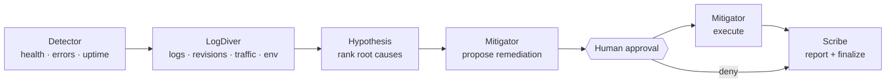

# gcp-sre-agents

Multi-agent **Incident Response Crew** for a demo Cloud Run platform in project `sre-multiagent` (`us-central1`). The orchestrator runs a specialist pipeline, pauses for human approval before remediation, then writes an evidence-backed report.

## Architecture

```
apps/
  api/              — Orchestrator, agent runners, tool surface, REST + Pub/Sub hooks
  web/              — BFF dashboard (approve / deny / soak)
  patient/          — Demo Cloud Run app; good + bad revisions
  chaos-controller/ — Cloud Run Admin API mutations (traffic split, env patch, /chaos/500)
packages/
  shared/           — Types, eval harness, scenario definitions
  cli/              — Local eval runner
```

**Data plane:** `MODE=gcp` → Firestore (runs/soak leases), BigQuery (evidence archive), GCS (reports). `MODE=local` → in-memory.

## Agent pipeline



In `REACT=on` (default in `MODE=gcp`), each agent runs a ReAct loop (Vertex AI Gemini, up to 6 turns). In `REACT=off` (default locally), agents execute a deterministic tool sequence — same tools, no LLM loop; used for CI eval.

Approval normalises the proposed actions before execution: malformed or incomplete `patch_env` details are patched against the deterministic fallback so the correct env vars always reach the Cloud Run Admin API.

## GCP components

Demo project: **`sre-multiagent`**, region **`us-central1`**.

| Layer | Service |
|---|---|
| Compute | Cloud Run — `patient`, `chaos-controller`, `api`, `web` |
| AI | Vertex AI (Gemini) |
| Observability | Cloud Logging, Cloud Monitoring, Uptime Checks |
| Data | Firestore, BigQuery, GCS |
| Messaging | Pub/Sub (`sre-incidents` topic → `api /hooks/pubsub`) |
| Security | Secret Manager, IAM (`roles/run.invoker`) |

Cloud Run services scale to zero by default. In `MODE=gcp`, chaos-controller mutates the real patient service via the Cloud Run Admin API; `/chaos/500` forces HTTP 500s. In `MODE=local`, chaos and tool responses are in-memory.

## Fleet / registry and alert correlation

`api` loads a **service registry** (`FLEET_REGISTRY` env var or default list) mapping service names to metadata (Cloud Run service name, PagerDuty routing key override, policy). Incoming Pub/Sub alerts are correlated against the registry to route incidents to the correct service and deduplicate concurrent runs per service (`MAX_CONCURRENT_PER_SERVICE`).

## Paging (Slack / PagerDuty)

Set `SLACK_WEBHOOK_URL` and/or `PAGERDUTY_ROUTING_KEY` (via Secret Manager → Cloud Run env). Notifications fire on `awaiting_approval` and terminal statuses (`completed` / `denied` / `failed`), with an approval deep-link to `WEB_ORIGIN/?runId=…`. Registry `pagerPolicy` can override PD routing key / severity per service.

## Running locally

```bash
npm ci
npm run eval
```

`MODE=local` (default) uses in-memory chaos and canned tool responses. No GCP credentials required.

## Running on GCP

### Deploy

```bash
./scripts/deploy-cloud-run.sh
```

Builds and deploys all four Cloud Run services, creates/updates IAM bindings, and pins the good/bad patient revisions.

```bash
./scripts/deploy-patient-bad-revision.sh
```

Refreshes only the bad-revision pin after patient changes.

### Open the UI

```bash
gcloud run services proxy web --project=sre-multiagent --region=us-central1 --port=8080
```

Open **http://127.0.0.1:8080**.

### Demo flow

1. **Inject** a scenario (bad-traffic split, env corruption, or forced 500s) via the UI.
2. **Investigate** — pipeline runs automatically; dashboard streams agent events.
3. **Approve or deny** the proposed remediation.
4. Scribe finalises the report regardless of the decision.

**Scenario soak** ("Run all scenarios") runs all three scenarios sequentially with auto-approved remediation — same effectiveness check as `npm run eval`. Soak state is Firestore-backed in `MODE=gcp` (survives cold starts). Check `GET /soak` or `/health` (`activeSoakId`, `activeRunIds`). Cancel a stuck soak with `POST /soak/cancel`.

### Verify GCP chaos locally

```bash
export PATIENT_SERVICE_URL="$(gcloud run services describe patient --region=us-central1 --format='value(status.url)')"
MODE=gcp GCP_PROJECT_ID=sre-multiagent GCP_REGION=us-central1 PATIENT_SERVICE_NAME=patient \
  GOOD_REVISION=... BAD_REVISION=... APP_SECRET=deployed-secret PATIENT_SERVICE_URL="$PATIENT_SERVICE_URL" \
  npx tsx scripts/verify-gcp-chaos.mts
```

## Key environment variables

| Variable | Default | Notes |
|---|---|---|
| `MODE` | `local` | `local` or `gcp` |
| `REACT` | `on` in gcp, `off` in local | Enable ReAct agent loops |
| `STORE_BACKEND` | `firestore` in gcp, `memory` in local | `firestore`, `memory` |
| `PAGING` | off in local, auto in gcp | `on` / `off` to force |
| `MAX_CONCURRENT_RUNS` | `1` | Global cap across all services |
| `MAX_CONCURRENT_PER_SERVICE` | `1` | Per-service run cap |
| `CHAOS_ADMIN_TOKEN` | — | Secret Manager; used by api inject path only, not exposed to agents |

## GitHub Actions / CI/CD

| Workflow | Trigger | What it does |
|---|---|---|
| **ci.yml** | push/PR → `main` | `npm ci`, build, typecheck |
| **codeql.yml** | push/PR → `main` + weekly | CodeQL security analysis (JS/TS) |
| **docker.yml** | push/PR → `main` | Build all four images (`push: false`) |
| **deploy-cloud-run.yml** | `workflow_dispatch` only | Manual deploy via WIF; needs `GCP_WORKLOAD_IDENTITY_PROVIDER` + `GCP_SERVICE_ACCOUNT` secrets |
