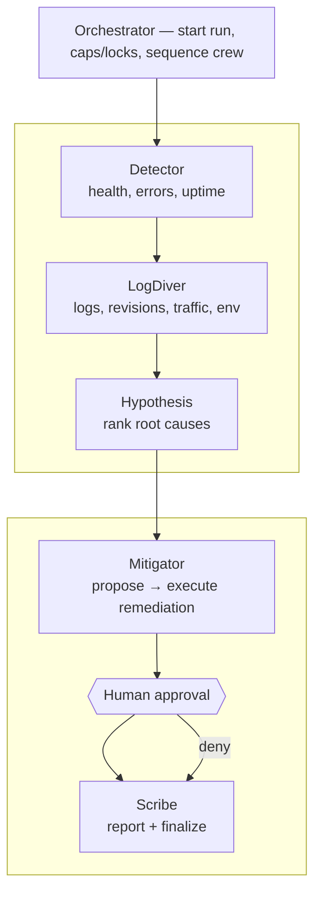

# gcp-sre-agents

Multi-agent **Incident Response Crew** for a demo Cloud Run “patient” app in project `sre-multiagent` (`us-central1`). The orchestrator runs a fixed specialist pipeline, pauses for human approval before remediation, then finalizes an evidence-backed report.

## Subagents



Flow: Detector → LogDiver → Hypothesis → Mitigator propose → approval → Mitigator execute (or deny) → Scribe. Remediation stays approval-gated; denial still runs Scribe so the timeline and report are complete.

## GCP components

Demo project: **`sre-multiagent`**, region **`us-central1`**.


Cloud Run services scale to zero by default. In **MODE=gcp**, chaos-controller mutates the real patient service via Cloud Run Admin API (traffic split; env patch for missing config). API tools read **Cloud Logging** and **Cloud Run** state; health checks hit the real patient `/health` (no local chaos overlay). Runs, soak leases, and Scribe artifacts use **Firestore / BigQuery / GCS**. In **MODE=local**, chaos stays in-memory and API tools use canned/overlay behavior for offline eval.

### Open the UI

```bash
gcloud run services proxy web --project=sre-multiagent --region=us-central1 --port=8080
```

Then open **http://127.0.0.1:8080**.

From the console you can inject a single scenario, investigate with a human approval gate, or run **Scenario soak** (“Run all scenarios”) — sequential eval of both scenarios with auto-approved remediation (same effectiveness check as CLI). Caps still apply per run. Locally you can still run `npm run eval`.

In **MODE=gcp**, soak state and investigation leases are **Firestore-backed** (survive multi-instance / cold starts). Locally, soak remains in-process. Check `GET /soak` or `/health` (`activeSoakId`, `activeRunIds`). Clear a stuck soak with `POST /soak/cancel`.

### AuthZ (API / web / chaos)

- **API** and remediation endpoints: Cloud Run IAM (`roles/run.invoker`); do not `--allow-unauthenticated` on `api`.
- **Web**: optional [IAP](https://cloud.google.com/iap/docs/enabling-cloud-run) on the console, or authenticated proxy (`gcloud run services proxy web`).
- **Chaos admin token** (`CHAOS_ADMIN_TOKEN`): Secret Manager only; used by the API inject path to call chaos-controller. It is **not** exposed to the LLM tool surface (`AGENT_TOOLS` / ReAct). See [docs/ops.md](docs/ops.md).

### Paging (Slack / PagerDuty)

Set `SLACK_WEBHOOK_URL` and/or `PAGERDUTY_ROUTING_KEY` (Secret Manager → Cloud Run env). Notifications fire on `awaiting_approval` and terminal statuses (`completed` / `denied` / `failed`), with an approval deep-link to `WEB_ORIGIN/?runId=…`. Registry `pagerPolicy` can override PD routing key / severity per service. `MODE=local` keeps paging off unless `PAGING=on`.

### Deploy / verify real GCP chaos

```bash
# Full rebuild + deploy (patient good+bad revisions, chaos, api) + IAM
./scripts/deploy-cloud-run.sh

# Or only refresh the bad revision pins after patient changes
./scripts/deploy-patient-bad-revision.sh

# Local smoke against live patient (ADC required)
export PATIENT_SERVICE_URL="$(gcloud run services describe patient --region=us-central1 --format='value(status.url)')"
MODE=gcp GCP_PROJECT_ID=sre-multiagent GCP_REGION=us-central1 PATIENT_SERVICE_NAME=patient \
  GOOD_REVISION=... BAD_REVISION=... APP_SECRET=deployed-secret PATIENT_SERVICE_URL="$PATIENT_SERVICE_URL" \
  npx tsx scripts/verify-gcp-chaos.mts
```

Local eval (in-memory chaos, no GCP): keep `MODE=local` and run `npm run eval`.

### Unit tests

```bash
npm test
```

Vitest unit tests cover shared eval/scenario/caps/policy helpers and API orchestrator pure logic (no live GCP/LLM). Use `npm run test:watch` while iterating.

## GitHub Actions / CI/CD

| Workflow | Trigger | What it does |
|---|---|---|
| **ci.yml** | push/PR → `main` | `npm ci`, build, and typecheck |
| **codeql.yml** | push/PR → `main` (+ weekly) | CodeQL security analysis (JS/TS) |
| **docker.yml** | push/PR → `main` | Build `patient`, `chaos-controller`, `api`, `web` images (`push: false`) |
| **deploy-cloud-run.yml** | `workflow_dispatch` only | Manual deploy via WIF; needs `GCP_WORKLOAD_IDENTITY_PROVIDER` + `GCP_SERVICE_ACCOUNT` secrets |
