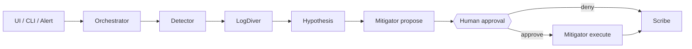

# gcp-sre-agents

Multi-agent **Incident Response Crew** for a demo Cloud Run “patient” app in project `sre-multiagent` (`us-central1`). The orchestrator runs a fixed specialist pipeline, pauses for human approval before remediation, then finalizes an evidence-backed report.

## Subagents

Investigation is sequential. The **orchestrator** starts the run (UI/CLI inject or Monitoring → Pub/Sub hook), enforces caps/locks, pauses at the approval gate, and hands control to Mitigator/Scribe after approve or deny.



| Agent | Model | When it runs | Role | Tools |
|---|---|---|---|---|
| **Orchestrator** | — | Entire run | Creates/locks the investigation, sequences specialists, pauses for approval, handles errors | — |
| **Detector** | Gemini 2.5 Flash-Lite | Step 1 | Confirms the patient is unhealthy and gathers first-pass health signals | `getServiceHealth`, `listRecentErrors`, `getUptimeCheckState` |
| **LogDiver** | Gemini 2.5 Flash-Lite | Step 2 | Deepens evidence: logs, error groups, revisions, traffic split, env | `queryLogs`, `getErrorGroup`, `listRevisions`, `getRevisionTraffic`, `getServiceEnv` |
| **Hypothesis** | Gemini 2.5 Flash | Step 3 | Ranks root causes from the evidence bundle (no external tools) | evidence only |
| **Mitigator** | Gemini 2.5 Flash | Step 4 (propose); after approve (execute) | Proposes allowlisted remediation; on approval runs rollback/env patch and rechecks health | `proposeRemediation`, `rollbackTraffic`, `patchEnvVars`, `verifyHealth` |
| **Scribe** | Gemini 2.5 Flash-Lite | After approve or deny | Writes the incident report, records a trace row, finalizes the run | `writeReport`, `writeBigQueryTrace`, `finalizeRun` |

Remediation is **approval-gated**: Mitigator only proposes until a human approves. Denial still runs Scribe so the timeline and report are complete.

## GCP components

Demo project: **`sre-multiagent`**, region **`us-central1`**.

### How they connect

```text
Cloud Monitoring (uptime / alert)
        │
        ▼
Pub/Sub (sre-incidents) ──push──► Cloud Run api  /hooks/pubsub
                                      │
                    Detector → LogDiver → Hypothesis → Mitigator ─┬─► approval
                                      │                           └─► Scribe
                    Vertex AI Gemini ◄─┘
                                      │
              chaos-controller ◄──────┤  (inject + remediate patient)
              patient (Cloud Run) ◄────┘
                                      │
web (Cloud Run console) ──BFF──► api
```

Images land in Artifact Registry; secrets come from Secret Manager; IAM keeps api/chaos/web private (patient is the public demo target).

### Products in use

| GCP product | What | Why |
|---|---|---|
| **Cloud Run** | Services: `patient`, `chaos-controller`, `api`, `web` | Hosts the demo app, fault injector/remediator, orchestrator API, and private console |
| **Artifact Registry** | Repo `sre-agents` (`us-central1-docker.pkg.dev/...`) | Stores container images built via Cloud Build |
| **Cloud Build** | `gcloud builds submit` in deploy scripts | Builds and pushes service images |
| **Cloud Monitoring** | Uptime check `patient-health` (`/health`); alert `patient-unhealthy` | Detects patient failure and notifies via Pub/Sub |
| **Pub/Sub** | Topic `sre-incidents` (+ DLQ); push sub → `api/hooks/pubsub` | Delivers alert notifications that start investigations |
| **Vertex AI / Gemini** | `gemini-2.5-flash-lite` / `gemini-2.5-flash` | LLM narration and reasoning for each specialist |
| **Secret Manager** | Secret `chaos-admin-token` | Shared admin token for chaos/remediation endpoints |
| **IAM** | `roles/run.invoker`, Pub/Sub push SA, `aiplatform.user`, `logging.viewer`, secret accessor | Private services, authenticated push, Vertex/Logging access |
| **Cloud Logging** | Viewer role on compute SA; LogDiver `queryLogs` tool | Intended log signal path for investigations |
| **Firestore** | Native DB provisioned in Terraform; `syncRunToFirestore` hook | Planned live run sync (currently stubbed in code) |
| **BigQuery** | Dataset `sre_agents` / table `investigation_traces` | Planned immutable traces (Scribe calls sync; write path stubbed) |
| **Cloud Storage** | Bucket `{project}-sre-agents-artifacts` | Provisioned for investigation artifacts |

Cloud Run services scale to zero by default. Agent tools talk to the patient health endpoint and **chaos-controller** for scenario state and allowlisted remediations (rollback traffic / patch env).
