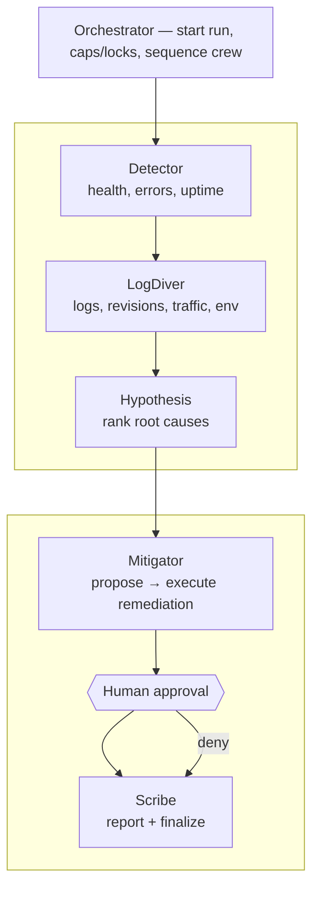
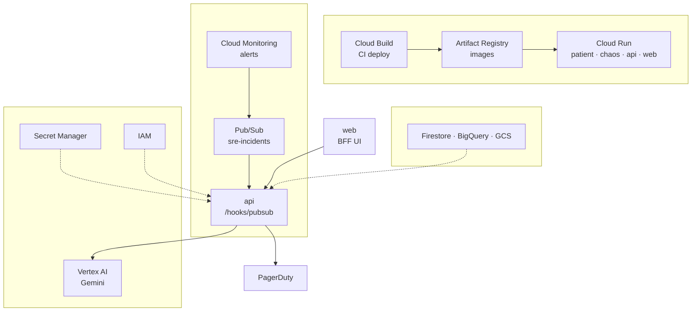

# gcp-sre-agents

## Subagents

## GCP components

Demo project: **`sre-multiagent`**, region **`us-central1`**.

## GitHub Actions / CI/CD

| Workflow | Trigger | What it does |
|---|---|---|
| **ci.yml** | push/PR → `main` | `npm ci`, build, typecheck, and unit tests |
| **codeql.yml** | push/PR → `main` (+ weekly) | CodeQL security analysis (JS/TS) |
| **docker.yml** | push/PR → `main` | Build `patient`, `chaos-controller`, `api`, `web` images (`push: false`) |
| **deploy-cloud-run.yml** | `workflow_dispatch` only | Manual deploy via WIF; needs `GCP_WORKLOAD_IDENTITY_PROVIDER` + `GCP_SERVICE_ACCOUNT` secrets |
