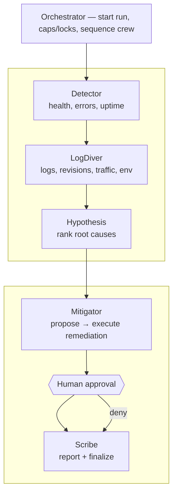
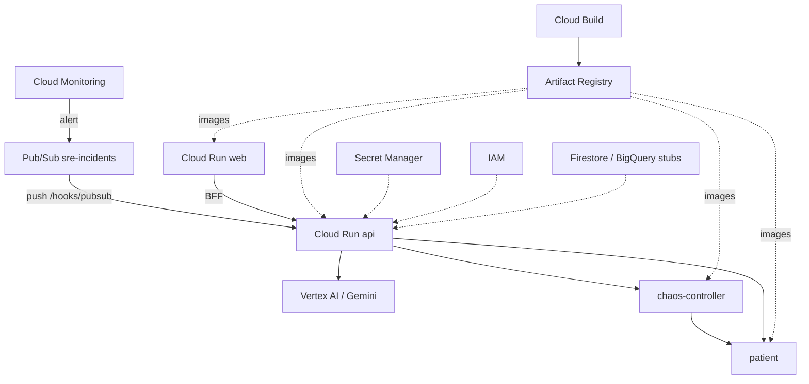

# gcp-sre-agents

Multi-agent **Incident Response Crew** for a demo Cloud Run “patient” app in project `sre-multiagent` (`us-central1`). The orchestrator runs a fixed specialist pipeline, pauses for human approval before remediation, then finalizes an evidence-backed report.

## Subagents



Flow: Detector → LogDiver → Hypothesis → Mitigator propose → approval → Mitigator execute (or deny) → Scribe. Remediation stays approval-gated; denial still runs Scribe so the timeline and report are complete.

## GCP components

Demo project: **`sre-multiagent`**, region **`us-central1`**.



Cloud Run services scale to zero by default. Agent tools hit the patient health endpoint and **chaos-controller** for scenario state and allowlisted remediations (rollback traffic / patch env).

### Open the UI

```bash
gcloud run services proxy web --project=sre-multiagent --region=us-central1 --port=8080
```

Then open **http://127.0.0.1:8080**.

## GitHub Actions / CI/CD

| Workflow | Trigger | What it does |
|---|---|---|
| **ci.yml** | push/PR → `main` | `npm ci`, build, and typecheck |
| **codeql.yml** | push/PR → `main` (+ weekly) | CodeQL security analysis (JS/TS) |
| **docker.yml** | push/PR → `main` | Build `patient`, `chaos-controller`, `api`, `web` images (`push: false`) |
| **deploy-cloud-run.yml** | `workflow_dispatch` only | Manual deploy via WIF; needs `GCP_WORKLOAD_IDENTITY_PROVIDER` + `GCP_SERVICE_ACCOUNT` secrets |
